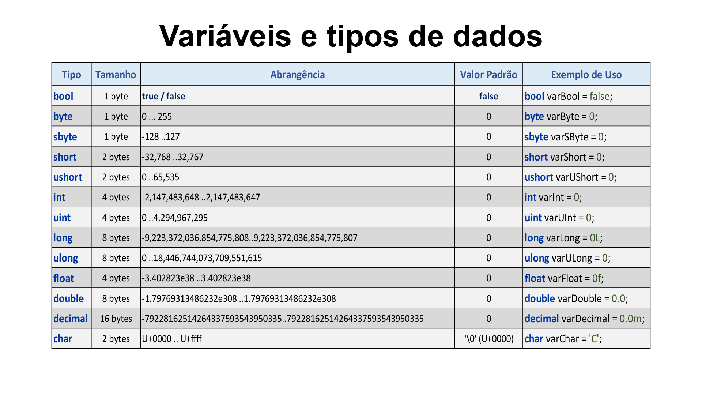
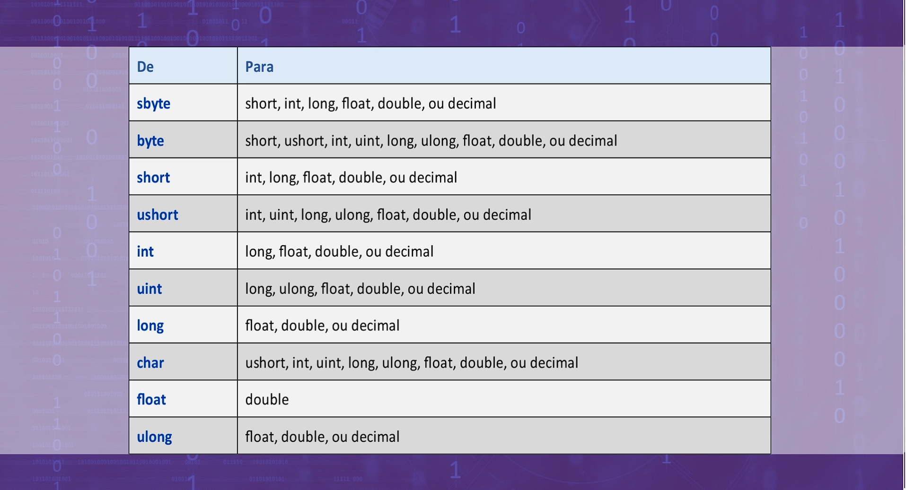
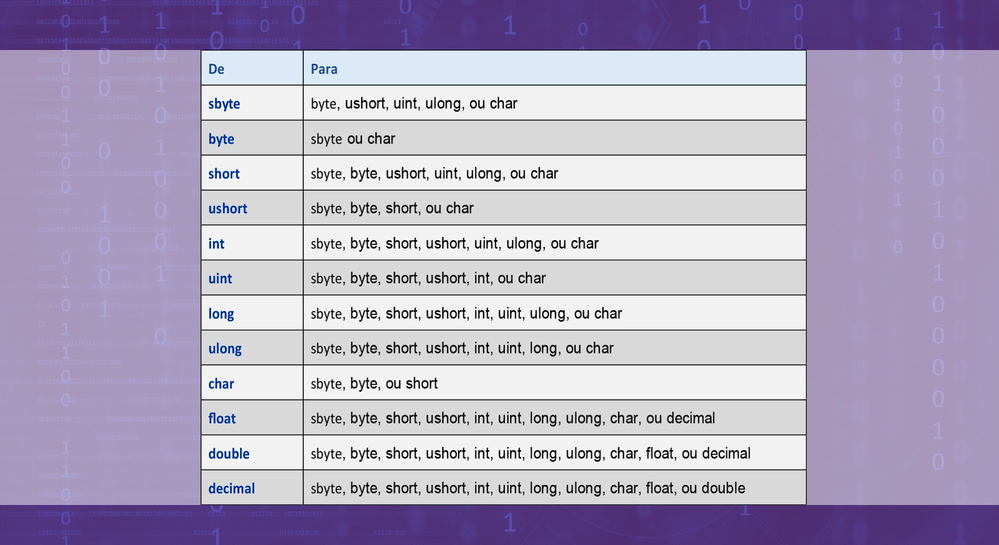

# Estudos em C#
> anotações e códigos com sintaxe básica utilizando o C# com finalidade de aprendizado e documentação para consultas futuras.


## Variáveis e tipos de dados

>Para o código fonte sobre, acesse:

> [variáveis e tipos de dados](Variaveis/Variaveis/Program.cs)
> 
> [colções (matriz uni e  bidimensional)](Colecao/Colecao/Program.cs)

<details>
    <summary>
        <h3>Tipos Dados e conversão de Dados</h3>
    </summary>

### Tipos de dados



### Conversão Implícita



### Conversão Explícita

> por haver perca de dados na conversão, o C# permite a conversão somente caso o programador utilize um cast para a conversão.



</details>

## Estruturas Condicionais

> Para o código fonte sobre, acesse:
>
> [Condicionais simples, encadeadas, aninhasdas e ternárias](Condicao/Condicao/Program.cs)


### Sintaxe operador ternário


```c#
variavel = (operação lógica) ? valor True : valor False;
```

## Estruturas de controle

> Para o código fonte sobre, acesse:
>
> [Estruturas de controle: Swith-Case e GoTo](Controle/Controle/Program.cs)


## Estruturas de Repetição

> Para o código fonte sobre, acesse:
>
> [Estruturas de repetição while, do-while, for e for each](Ciclos/Ciclos/Program.cs)

## POO

> **Definição formal:** Orientação a Objetos significa organizar o mundo real como uma coleção de objetos que incorporam a *estrutura de um conjunto de dados* e um conjunto de *operações que manipulam estes dados*.
>

> Para o código fonte sobre, acesse:
>
> - [Métodos - simples, com retorno, com sobrecarga](POO/MetodosDasClasses/Metodos.cs) 
> - [this](POO/TermoThis/Acessar.cs)
> - [Delegate](POO/TipoDelegate/Matematica.cs) (Tipo de dado personalizado, métodos com o **mesmo tipo de retorno** e com a **mesma assinatura**)
> - [Método Construtor](POO/MetodoConstrutor/Pessoa.cs) (método construtor é executado sempre na instanciação da classe, para que sejam criados todos os itens da classe, executando métodos e/ou definindo valores padrão. *É sempre público e não possui retorno*.)
> - [Classes Estáticas](POO/Estaticas/Matematica.cs)(visível à todo o programa. Não pode ser instanciada. Membros estáticos poder ser usados sem instanciar o objeto).
> - Quando a classe fica extensa, é possível dividir a mesma classe em arquivos diferentes, `partial class NomeDaClasse...`
> - [Código Exemplo Herança](POO/Heranca). Herança: facilita na implementação e manutenção do programa.
>   - Classes abstradas não podem ser instanciadas, servem apenas de base para outras classes.
>   - Membros e atributos abstratos obrigam a classe filha a implentar o próprio método, e não possuem definição em sua origem.
>   - em C# é possível utilizar heranças encadeadas. `sealed` define que a classe **não pode** ser herdadada, serve apenas para a criação de objetos, o inverso das classes `abstract`.
>   - [Método Virtual](POO/Heranca/Classes.cs). Métodos `virtual` podem ser sobrescritos e podem ter uma implementação base.
> - [Modificadores de Acesso](POO/Modificadores/Classes.cs)
> - [Polimorfismo](POO/Polimorfismo/Classes.cs)
> - [Interfaces](POO/Polimorfismo/Conta.cs). A interface é uma classe abstrata e está relacionada ao polimorfismo,  é um **contrato que obriga** a quem utilizar a classe, deve implementar todos os seus membros. Todos os membros de uma interface são abstratos, e não possuem parâmetros na implementação.

## Métodos

> - [Exemplo recursividade](Recursividade/Recursividade/Recursiva.cs)
> - [Método main com parâmetros](MetodoMain/MetodoMain/Program.cs)